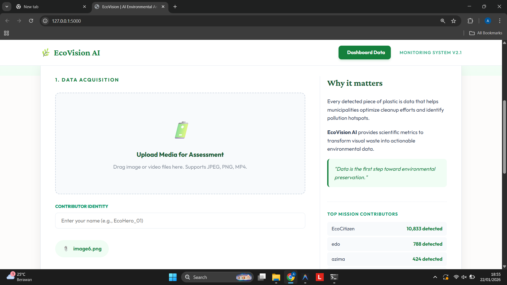
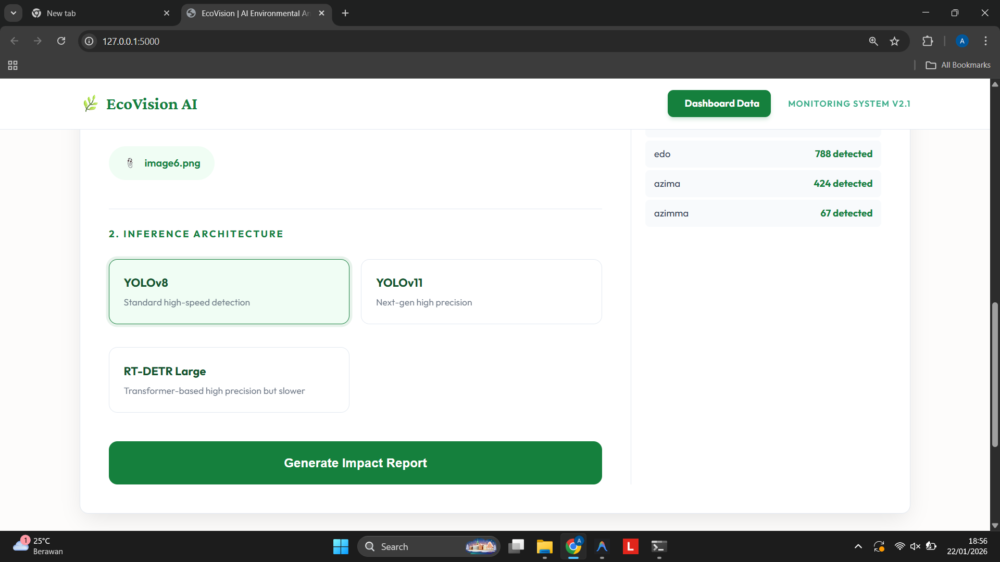
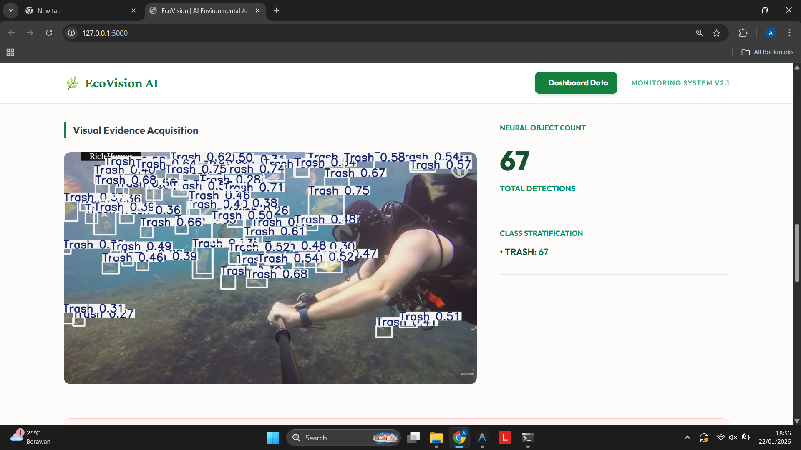
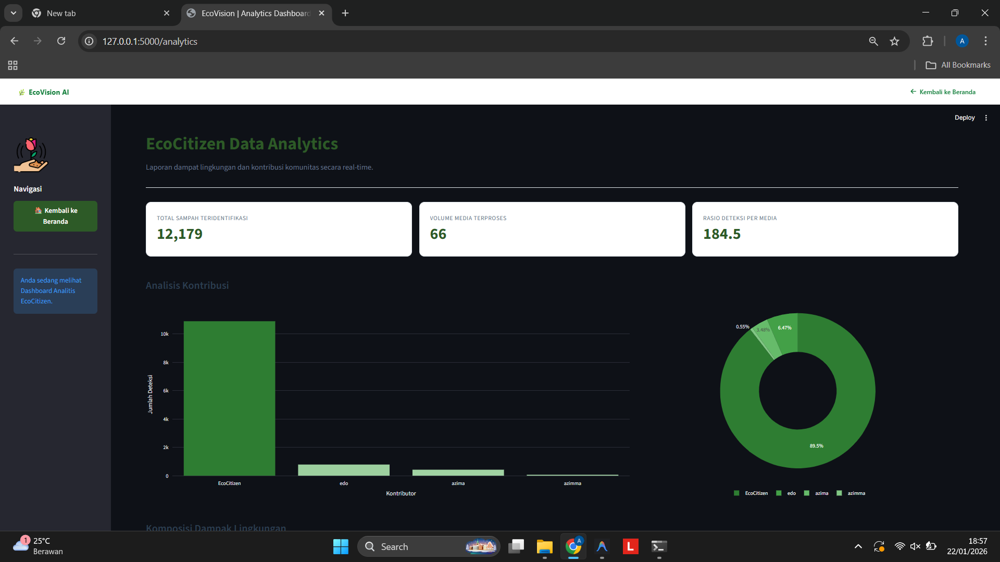
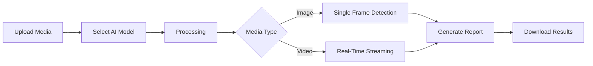

<p align="center">
  
  
  
  
  
</p>

<h1 align="center">🌿 EcoVision AI</h1>

<p align="center">
  <b>Real-Time Environmental Pollution Detection & Analytics Platform</b><br>
  <i>Combating Plastic Pollution with Computer Vision Technology</i>
</p>

<p align="center">
  
</p>

---

## 📌 Overview

**EcoVision AI** adalah platform berbasis kecerdasan buatan yang dirancang untuk mendeteksi, melacak, dan menganalisis polusi lingkungan secara real-time. Dengan memanfaatkan model Computer Vision canggih seperti YOLOv8, YOLOv11, dan RT-DETR, sistem ini dapat mengidentifikasi sampah plastik dari gambar maupun video dengan akurasi tinggi.

Platform ini dikembangkan sebagai solusi untuk membantu pemerintah daerah, organisasi lingkungan, dan komunitas dalam mengoptimalkan upaya pembersihan polusi serta mengidentifikasi titik-titik rawan sampah (*pollution hotspots*).

---

## ✨ Key Features

| Feature | Description |
|---------|-------------|
| 🤖 **Multi-Model AI** | Pilihan 3 arsitektur neural network: YOLOv8, YOLOv11, dan RT-DETR |
| 🎥 **Real-Time Streaming** | Proses video upload dan stream deteksi langsung ke browser |
| 🔢 **Centroid Tracking** | Algoritma pelacakan objek unik untuk mencegah duplikasi penghitungan |
| 📊 **Pollution Assessment** | Scoring otomatis tingkat keparahan (Low, Medium, High, Critical) |
| 🧹 **Auto Cleanup** | Pembersihan otomatis file upload dan output untuk menghemat storage |
| 📈 **Interactive Dashboard** | Visualisasi data dengan Chart.js dan leaderboard kontributor global |

---

## 🖼️ Screenshots

### Model Selection Interface
<p align="center">
  
</p>

### Detection Output Result
<p align="center">
  
</p>

### Streamlit Analytics Dashboard
<p align="center">
  
</p>

---

## 🛠️ Tech Stack

```
Backend       : Python 3.10+, Flask 2.3.3
AI/ML         : Ultralytics YOLO, RT-DETR, PyTorch 2.0+
Computer Vision: OpenCV 4.8.1
Analytics     : Streamlit, Chart.js
Frontend      : HTML5, CSS3, JavaScript ES6+
Fonts         : Google Fonts (Outfit, Crimson Pro)
```

---

## 🧠 AI Models & Training

Aplikasi ini menggunakan model AI yang dilatih khusus untuk mendeteksi sampah bawah laut. Berikut adalah repository untuk training masing-masing arsitektur model:

<table>
  <tr>
    <td align="center" width="33%">
      <a href="https://github.com/Azima28/YOLOv8-Underwater-Trash-Detection">
        <br><br>
        <b>🚀 YOLOv8 Training</b>
      </a>
      <br><br>
      <sub>High-speed detection dengan arsitektur YOLO terbaru dari Ultralytics. Optimal untuk real-time inference.</sub>
    </td>
    <td align="center" width="33%">
      <a href="https://github.com/Azima28/YOLOv11-Underwater-Trash-Detection">
        <br><br>
        <b>⚡ YOLOv11 Training</b>
      </a>
      <br><br>
      <sub>Next-generation YOLO dengan peningkatan akurasi dan efisiensi. State-of-the-art performance.</sub>
    </td>
    <td align="center" width="33%">
      <a href="https://github.com/Azima28/RT-DETR-Underwater-Trash-Detection">
        <br><br>
        <b>🔬 RT-DETR Training</b>
      </a>
      <br><br>
      <sub>Transformer-based detection dengan akurasi tinggi. Ideal untuk analisis detail yang presisi.</sub>
    </td>
  </tr>
</table>

> **📖 Panduan Training:** Kunjungi masing-masing repository di atas untuk dokumentasi lengkap cara melatih model dengan dataset custom Anda sendiri. Setelah training selesai, letakkan file `.pt` hasil training ke folder `models/` untuk digunakan di aplikasi ini.

---

## 📁 Project Structure

```
EcoVision-AI/
├── app.py                  # Main Flask application
├── dashboard.py            # Streamlit analytics dashboard
├── config.yaml             # Application configuration
├── requirements.txt        # Python dependencies
│
├── models/                 # AI model weights (.pt files)
│   ├── yolov8n.pt
│   ├── yolov11.pt
│   └── rtdetr.pt
│
├── services/               # Core business logic
│   ├── video_service.py    # Video streaming & processing
│   ├── stats_service.py    # Global statistics tracker
│   └── cleanup_service.py  # Automated file cleanup
│
├── utils/                  # Helper utilities
│   ├── model.py            # Model loader
│   ├── processors.py       # Image/video processors
│   └── config_loader.py    # YAML config loader
│
├── templates/              # HTML templates
├── static/                 # CSS & JavaScript assets
├── data/                   # Persistent data storage
└── docs/                   # Documentation
```

---

## 🚀 Getting Started

### Prerequisites
- Python 3.10 atau lebih baru
- pip (Python package manager)
- GPU dengan CUDA support (opsional, untuk performa optimal)

### Installation

1. **Clone repository**
   ```bash
   git clone https://github.com/Azima28/underwater-trash-detection-application.git
   cd underwater-trash-detection-application
   ```

2. **Buat virtual environment**
   ```bash
   python -m venv venv
   
   # Windows
   venv\Scripts\activate
   
   # Linux/Mac
   source venv/bin/activate
   ```

3. **Install dependencies**
   ```bash
   pip install -r requirements.txt
   ```

4. **Download model weights**
   
   Letakkan file model `.pt` ke dalam folder `models/`:
   - `yolov8n.pt`
   - `yolov11.pt`  
   - `rtdetr.pt`

5. **Jalankan aplikasi**
   ```bash
   python app.py
   ```

6. **Akses web interface**
   
   Buka browser dan navigasi ke: `http://localhost:5000`

---

## 📊 How It Works



1. **Upload** - Pengguna mengunggah gambar atau video
2. **Model Selection** - Pilih arsitektur AI sesuai kebutuhan
3. **Processing** - Sistem memproses media dengan model terpilih
4. **Detection** - Objek sampah teridentifikasi dan dihitung
5. **Assessment** - Sistem memberikan skor tingkat polusi
6. **Report** - Hasil analisis ditampilkan dengan visualisasi interaktif

---

## 🔧 Configuration

Konfigurasi aplikasi dapat diubah melalui file `config.yaml`:

```yaml
server:
  host: "0.0.0.0"
  port: 5000
  debug: true

processing:
  inference_conf: 0.20    # Confidence threshold
  imgsz: 640              # Inference image size

cleanup:
  interval_seconds: 300   # Cleanup interval
  max_age_seconds: 900    # Max file age before deletion
```

---

## 🎯 Detection Classes

| Class | Description |
|-------|-------------|
| `trash` | General plastic waste and debris |
| `bio` | Biodegradable organic waste |
| `rov` | Recyclable objects and materials |

---

## 🤝 Contributing

Kontribusi sangat disambut! Silakan ikuti langkah berikut:

1. Fork repository ini
2. Buat branch fitur (`git checkout -b feature/amazing-feature`)
3. Commit perubahan (`git commit -m 'Add amazing feature'`)
4. Push ke branch (`git push origin feature/amazing-feature`)
5. Buka Pull Request

---

## 📝 License

Distributed under the MIT License. See `LICENSE` for more information.

---

## 📧 Contact

<p align="center">
  <a href="https://github.com/Azima28/underwater-trash-detection-application">
    
  </a>
  &nbsp;&nbsp;
  <a href="https://www.instagram.com/zimm.dev">
    
  </a>
</p>

<p align="center">
  <sub>💬 Feel free to reach out for collaboration or questions!</sub>
</p>

---

<p align="center">
  <b>🌍 Sustainability through Intelligent Vision</b><br>
  <i>EcoVision AI is part of a global effort to track and eliminate plastic waste via scalable deep learning solutions.</i>
</p>

<p align="center">
  Made with 💚 for a cleaner planet
</p>
